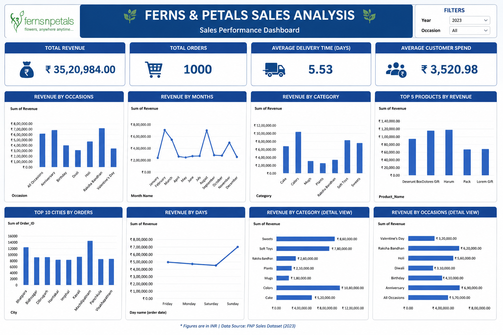

# 🌸 Ferns & Petals Sales Analysis Dashboard

## 📌 Project Overview

This project presents a comprehensive sales analysis dashboard for **Ferns & Petals (FNP)**, a leading gifting company specializing in occasion-based gift delivery. The dashboard was developed using **Microsoft Excel** to analyze sales performance, customer purchasing behavior, delivery efficiency, and product trends.

The objective of this project is to transform raw sales data into meaningful business insights through an interactive dashboard that supports data-driven decision-making.

---

## 🎯 Business Problem

Ferns & Petals wanted to answer the following business questions:

- Which occasions generate the highest revenue?
- Which product categories contribute the most sales?
- Which cities place the highest number of orders?
- What is the average delivery time?
- How much does each customer spend on average?

---

## 📊 Dataset Information

- **Total Orders:** 1,000
- **Total Revenue:** ₹35,20,984
- **Tool Used:** Microsoft Excel

---

## 📈 Dashboard KPIs

- 💰 Total Revenue
- 👥 Average Customer Spend
- 🚚 Average Delivery Time
- 📅 Monthly Sales Trend
- 🎉 Revenue by Occasion
- 📦 Product Category Performance
- 🏆 Top 5 Products
- 🌍 Top 10 Cities by Orders

---

## 🚀 Dashboard Features

- Interactive Slicers
- Pivot Tables
- Pivot Charts
- KPI Cards
- Dynamic Filtering
- Sales Trend Analysis
- Occasion-wise Revenue Analysis
- City-wise Order Analysis

---

## 💡 Key Business Insights

### 💰 Revenue
- Total revenue generated: **₹35.2 Lakhs**

### 👥 Customer Behavior
- Average customer spending: **₹3,520**

### 🚚 Delivery Performance
- Average delivery time: **5.53 days**

### 📦 Product Performance
- Best-selling products contributed the highest share of total revenue.

### 🎉 Occasion Analysis
- Seasonal occasions such as **Diwali, Valentine's Day, Birthdays, and Raksha Bandhan** significantly influenced sales and revenue.

---

## 📌 Business Recommendations

- Increase inventory before high-demand occasions.
- Improve logistics in cities with longer delivery times.
- Focus marketing campaigns on high-performing occasions.
- Promote best-selling products through targeted offers and discounts.

---

## 🛠️ Tools & Technologies

- Microsoft Excel
- Pivot Tables
- Pivot Charts
- Slicers
- KPI Dashboard
- Data Cleaning
- Business Analytics

---

## 🖼️ Dashboard Preview

```
```

---

## 📂 Repository Structure

```text
ferns-petals-sales-analysis/
│
├── README.md
├── dashboard.png
├── PROJECT_excel.xlsx
└── Ferns and Petals Sales Analysis.pdf
```

---

## 🎯 Skills Demonstrated

- Advanced Excel
- Dashboard Design
- Data Cleaning
- Data Visualization
- KPI Reporting
- Business Analytics
- Sales Analysis
- Business Intelligence

---

## 👨‍💻 Author

**Kathan Chawla**

📧 Feel free to connect with me on LinkedIn and explore more of my data analytics projects.
